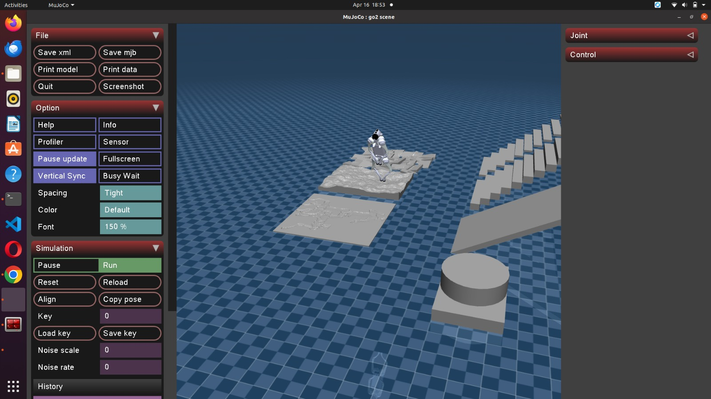

# 🧪 Instalación de entorno de simulación para Unitree Go2

---

## 📌 Descripción

La simulación permite ejecutar y probar el comportamiento del robot Unitree Go2 sin necesidad de hardware físico.

En este caso, se utiliza un entorno basado en **MuJoCo**, junto con la SDK2, para simular:

* Movimiento
* Control
* Ejecución de comandos

---

## 🧠 Conceptos Clave

### 🎮 Simulación

* Replica el comportamiento del robot en un entorno virtual
* Permite pruebas seguras sin riesgo físico

### ⚙️ MuJoCo

* Motor de simulación física
* Permite modelar dinámicas realistas del robot

### 🔗 Integración con SDK2

* Se usa el mismo flujo de comandos
* Compatible con control de alto nivel

---

## ⚙️ Requisitos

* Ubuntu 20.04
* Python 3
* Git
* SDK2 Python instalado
* ROS2 (opcional)

---

## 🚀 Instalación del entorno de simulación

### 1️⃣ Clonar repositorio de simulación

```bash id="m1e2vc"
git clone https://github.com/unitreerobotics/unitree_mujoco.git
```

### 2️⃣ Entrar al directorio

```bash id="4r0yul"
cd unitree_mujoco
```

### 3️⃣ Instalar dependencias

```bash id="9vjq1b"
pip3 install -r requirements.txt
```

---

## 🔧 Configuración

Asegúrate de tener correctamente instalado:

* SDK2 Python
* Librerías necesarias de simulación

---

## ▶️ Ejecución de la simulación

Según el flujo del curso:

```bash id="a8w8vw"
go2_sport_client
```



---

## 🤖 Uso de la simulación

En simulación puedes:

* Ejecutar comandos de movimiento
* Probar scripts en Python
* Validar trayectorias
* Simular control del robot

---

## 📊 ¿Para qué usar simulación?

✔ Probar código sin robot físico
✔ Evitar daños en hardware
✔ Desarrollo inicial
✔ Validación de algoritmos

---

## ⚠️ Notas importantes

* La simulación no reemplaza completamente el robot real
* Puede haber diferencias físicas
* Se usa el mismo flujo de comandos que en el robot real

---

## 📚 Recomendación

Flujo recomendado:

1. Simulación (MuJoCo)
2. Pruebas en entorno controlado
3. Ejecución en robot real