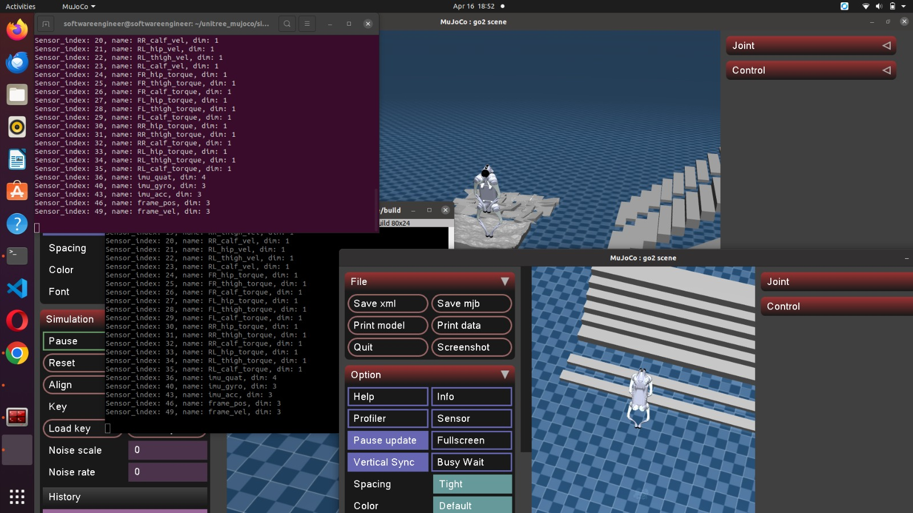

#  Ejecución de simulación en Unitree Go2

---

##  Descripción

Este apartado describe cómo ejecutar la simulación del robot Unitree Go2 utilizando los ejemplos disponibles en la SDK2.

La simulación permite probar comandos de control y validar comportamientos sin necesidad del robot físico.

---

##  Conceptos Clave

###  Flujo de ejecución

* Inicializar entorno
* Ejecutar cliente de control
* Enviar comandos
* Observar comportamiento

###  Control en simulación

* Se utilizan los mismos comandos que en el robot real
* Basado en control de alto nivel

---

##  Requisitos

* Entorno de simulación instalado
* SDK2 Python configurado
* Terminal activa

---

##  Ejecución básica

Según el flujo del curso, la simulación se ejecuta con:

```bash id="0f3u0r"
go2_sport_client
```



Este comando inicia el entorno de control para el robot en simulación.

---

##  Ejecución de ejemplos en Python

Ir al directorio de ejemplos:

```bash id="o7j2mx"
cd ~/unitree_sdk2_python/example/go2
```

Ejecutar ejemplo:

```bash id="r0kh0f"
python3 go2_sport_client_example.py <networkInterface>
```

---

##  Control con teclado (WASD)

Ejecutar:

```bash id="0g5q3w"
python3 go2_wasd_control.py <networkInterface>
```

### Controles:

* **W** → Avanzar
* **S** → Retroceder
* **A** → Izquierda
* **D** → Derecha
* **Q** → Rotar izquierda
* **E** → Rotar derecha
* **ESC** → Salir

---

##  Flujo típico de uso

1️ Iniciar simulación
2️ Ejecutar script Python
3️ Enviar comandos
4️ Observar comportamiento
5️ Ajustar parámetros

---

##  ¿Qué se puede probar?

* Movimiento del robot
* Control de velocidad
* Cambios de modo (stand, sit, etc.)
* Trayectorias básicas

---

##  Notas importantes

* Usar la interfaz de red correcta (`eth0`, `lo`, etc.)
* Los comandos son equivalentes al robot real
* Ideal para pruebas antes de usar hardware

---

##  Recomendación

Antes de ejecutar en robot real:

✔ Validar en simulación
✔ Ajustar velocidades
✔ Probar secuencias completas